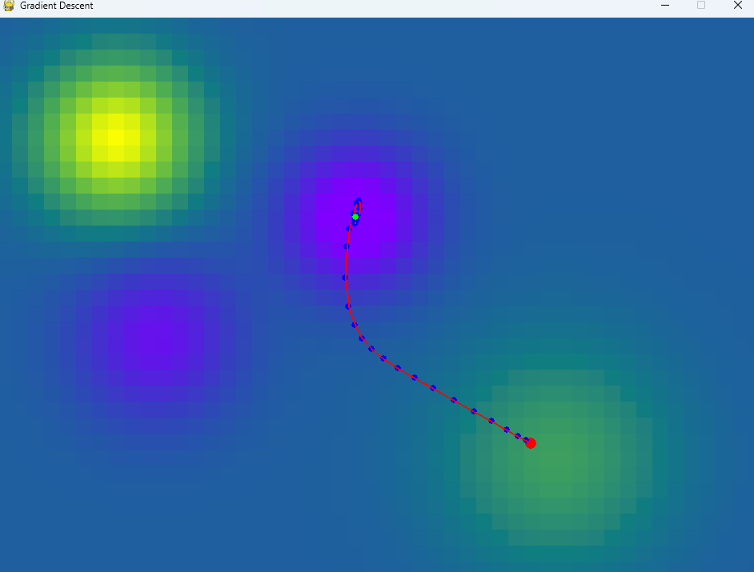

# gradientDescentVisualization
Visualization for the Gradient Descent Algorithm written in Python using the pygame graphics lib. Utilizes momentum to "roll" through zero-gradients and a backtracking line search to determine step size. 

